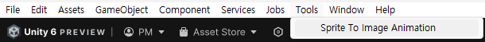
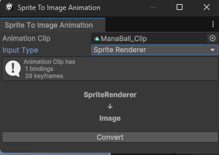
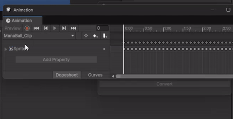
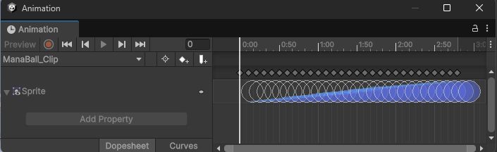
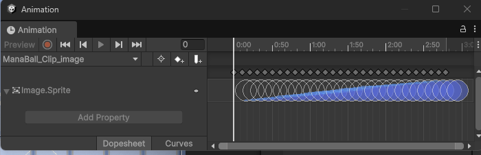

# SpriteAnimationConverter
This feature allows you to convert animations for Unity SpriteRenderer into animations for Image.
Typically, this tool turns a SpriteRender into an Image, but you can also turn an Image into a SpriteRender by changing the InputType.
> [!NOTE]
The output of Aseprite's animation clips is a SpriteRenderer Animation Clip, but with this tool, you can easily use them with UI.Image components as well.

## Script
[SpriteAnimationConverterWindow.cs](SpriteAnimationConverterWindow.cs)

## How To Use
### Open Window

- **MenuItem:**  Click "Tools -> Sprite To Animation"
### Interface

- **Animation Clip:** Animated clips should use SpriteRenderer or Image Type.
- **InputType:**  InputType is assigned automatically when animation clip is set. Can also change it manually.
- **Help Box:** Displays a warning if an invalid condition is found.
- **Convert:** Converts SpriteRender assignments within the Animation Clip to Image.

## Example

- **Original Animation Clip(SpriteRenderer)**
  

- **Converted Animation Clip(Image)**
  

